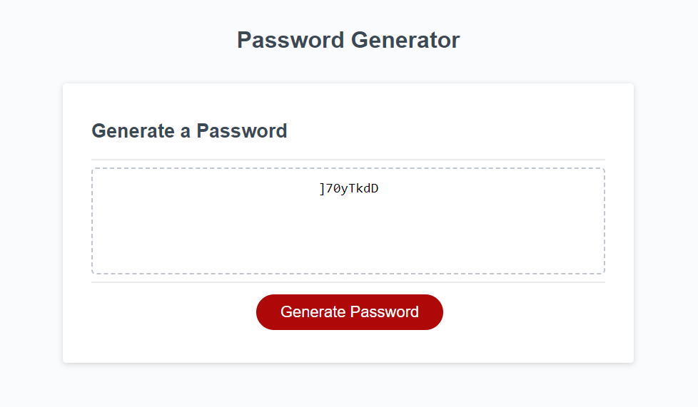

# Passwordgenerator

## Description

This is my 3rd project, which is a password generator. The code was already started for me, all I had to do was the generator itself.

## Installation

N/A

## Usage

Please go to https://valerigionetnoel.github.io/Passwordgenerator/ to use my website.

To use this website, click on the red generate password button. You will be ask how many character you want, if you want upper case, lower case or special character and if you want numbers. After you make your choice, it will give you a randomly generated password.

## Credit

N/A

## License

Refer to the LICENSE in the repo.